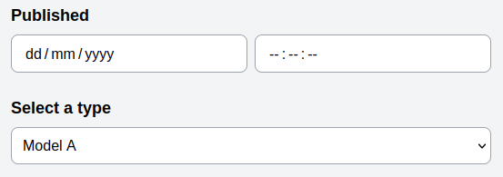

# Configuration

## The Basics
Helium is based around the idea that everything is configurable and modular. Handlers contain all of the logic, twig templates handle the rendering and the configuration specifies which handlers and templates should be used. Configuration can often be given in short form which is expanded automatically with sensible defaults.

Using fields as an example, providing just the string "title" with no key will generate a text input with it's slug, name and id set to the "title". It will be assigned default handlers to read the value from and save the value to the title attribute on the entitie's model. It will also be given a label by transforming the slug to the more human friendly format "Title". Everything required for that simple text field can be deduced from the slug. 

```php
'fields' => [
    'title',
],
```


## Setting options
Any of the configuration options can be set manually by providing an array as a value with the slug as the key. To override the label we can set it in the configuration array. All other configuration options will continue to be deduced as before and if a value is overridden that is used to deduce another, your overridden value will be used in that deduction. For example, the any validation messages use the field label to build a message; overriding the label will update both.

```php
'fields' => [
    'title' => [
        'label' => 'Item Title'
    ],
],
```


## Base Classes
All configurable elements within Helium have a base class that takes a configuration array and provides sensible defaults. Helium provides a few of these for example with field types. To set the base class to something other than the default, we can either set config value to the base class name or we can pass the class name as the `base` option and supply any other options alongside.

```php
'fields' => [
    'published' => DateTimeField::class,
    'type' => [
        'base' => SelectField::class,
        'options' => [
            'a' => 'Model A',
            'b' => 'Model B',
        ],
        'label' => 'Select a type',
    ]
],
```


 
## Extending Base Classes
Instead of repeating common configurations, we can extend the base class to set new defaults while still maintaining the ability to configure the parts we want for individual uses. Base classes can take any number of configuration options and expose them as attributes using PHP magic. Dynamic values are provided from the configured options and if a value is not set then the base class defaults are used. If neither are set then null is returned.

As a simplified example we can make a input type that uses a different template to render the field. The below will use the new template if no other template option is set in the config.

```php
class MyBaseField extends Field
{
    public function getDefault($key)
    {
        switch ($key) {
            case 'template':
                return 'path.to.mytemplate';
        }

        return parent::getDefault($key);
    }
}
```

## Keeping Things Tidy
Custom base classes can also be used as a way to keep the configuration files tidy and organised. By moving the default options for an element to their own class it reduces clutter while keeping things easy to find and easy to manage.

As an example, you might define a form view as a new class. You can either override `getDefault()` or just add your config directly. The main benefit of using `getDefault()` is that config values can reference other config values without worrying about whether they have been defined yet.

```php
// In the Entity config
'views' => [
    'edit' => EditPostsForm::class,
],
```

```php
class EditPostsForm extends FormView
{
    protected $config = [
        'tabs' => [
            'main' => 'Content',
        ],
        'fields' => [
            'main' => [
                'title',
                'published' => DateTimeField::class,
            ],
        ],
        'actions' => [
            'save' => SaveFormAction::class
        ]
    ];
}
```


## Handlers

Handlers are passed to configs as a callable string. Any string that can be called through Laravels `app()->call()` can be given as a value. All of the handlers within Helium are invokable classes.

As an example, to provide options for a select field, instead of an array we can pass a handler. The handler is called through the service container so can use dependency injection and in this case must return an array of options. Whenever a handler is accepted, there will also be a handler parameters option to match. These can provide some arguments that are passed through the service container for dependency injection.

The example below is a simplified use case to give the option of all enabled entries from a model

```php
'fields' => [
    'author_id' => [
        'base' => SelectField::class,
        'optionsHandler' => ModelOptionsHandler::class,
        'optionsHandlerParams' => [
            'model' => User::class,
            'displayField' => 'name',
        ],
    ]
],
```

```php
class ModelOptionsHandler
{
    public function invoke(string $model, string $displayField): array
    {
        return $model::where('enabled', true)->pluck($displayField, 'id');
    }
}
```

Handlers are used throughout Helium to keep the core functionality as modular and replacable as possible and to allow dynamic configuration. In most cases where a handler is expected, Helium will provide default handlers that can be extended.
